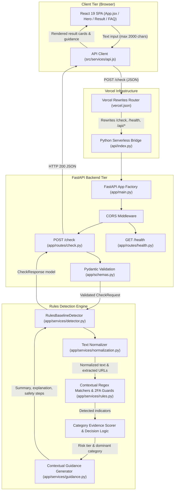

# ScamCheck: Explainable Decision-Support System for Digital Scam Detection

**Capstone Project Final Report**
*BuildLabs Applied AI Engineering Cohort 2*
**Author / Participant:** Quantumdata66
**Repository:** [https://github.com/Quantumdata66/Scamcheck](https://github.com/Quantumdata66/Scamcheck)
**Live Application:** [https://scam-check-eight.vercel.app/](https://scam-check-eight.vercel.app/)
**Date:** October 2026

---

## Executive Summary & Abstract

Digital communication channels, including SMS, WhatsApp, Telegram, email, and social media, are increasingly targeted by social engineering campaigns. Threat actors exploit psychological heuristics such as urgency, fear of financial loss, and unrealistic reward promises to execute SMS smishing, fraudulent recruitment schemes, and high-yield investment scams. While conventional spam filters focus on network-level telemetry and static blacklists, end-users frequently lack explainable, real-time decision-support tools to evaluate suspicious message text before taking irreversible actions.

**ScamCheck** addresses this challenge by delivering a lightweight, text-only screening tool that combines an explainable rules-based production detection engine with a series of empirical machine learning investigations. The production application normalizes user-submitted text, evaluates it against a curated taxonomy of 16 warning indicators across three primary threat domains (`bank_payment`, `fake_job`, `investment`), applies negative 2FA guard suppression, and assigns a three-tier risk assessment (`low`, `needs_verification`, `high`) accompanied by plain-language justifications and actionable safety steps.

Alongside the production application, three standalone machine learning experiments were conducted to evaluate statistical modeling:
1. **Experiment 01 (Word TF-IDF + Logistic Regression):** Achieved **97.62% test accuracy** on held-out synthetic messages ($N=42$) and elevated adversarial detection from 0.0% to **53.85%**.
2. **Experiment 02 (Subword Character N-Gram TF-IDF + Logistic Regression):** Achieved **90.48% test accuracy** on synthetic data, demonstrated superior adversarial resilience (**61.54%**), and reduced out-of-domain false positives on long text by **73.4%** compared to word-level modeling.
3. **Experiment 03 (EMSCAD-Trained Fake-Job Classifier):** Evaluated native long-form recruitment classification on $16,201$ unique EMSCAD postings, achieving **97.41% test accuracy, 86.11% scam recall, and 0.8616 PR-AUC** on held-out job ads ($N=2,431$). Cross-modality transfer testing on short smishing messages ($N=37$) demonstrated a steep recall collapse to **30.43%**, highlighting structural domain divergence between long job advertisements and short conversational lures.

All findings, production code, automated test suites (88/88 passing), and dataset artifacts are documented and reproducible.

---

## 1. Problem Statement & Motivation

### 1.1 The Challenge of Modern Social Engineering
Consumer-facing digital fraud has evolved rapidly from crude bulk spam into sophisticated, highly contextualized text campaigns. According to the Federal Trade Commission (FTC) and global cybersecurity reports, digital impersonation and smishing represent multi-billion-dollar annual loss categories:
- **Banking & Payment Scams:** Fraudsters fabricate urgent account freeze notices, unauthorized debit alerts, or request one-time passcodes (OTPs) under the guise of fraud prevention.
- **Recruitment & Task Fraud:** Scammers advertise high-paying remote roles, conduct immediate "hiring" on messaging platforms without interviews, and demand upfront training fees or task-rebate deposits.
- **Investment & Crypto Schemes:** Unsolicited messages promote automated algorithmic bots, insider trading signals, and "guaranteed" daily returns using artificial FOMO countdowns.

### 1.2 Limitations of Existing Solutions
Existing consumer defenses suffer from three critical shortcomings:
1. **Opaque Black-Box Classifiers:** Many security tools output binary "spam/clean" flags without explaining *why* a message was flagged, preventing users from developing long-term security awareness.
2. **Over-Reliance on Network Metadata:** URL shorteners, disposable phone numbers, and cross-platform hopping (e.g., SMS to Telegram) frequently bypass traditional domain and sender reputation lists.
3. **False Alarms on Legitimate Authentication:** Aggressive keyword filters often misclassify legitimate bank 2FA notices that contain sensitive terms (e.g., "verification code", "security code").

### 1.3 Project Aim & Objectives
The aim of ScamCheck is to engineer an accessible, transparent, and responsive decision-support application that empowers non-technical users to inspect suspicious communications and receive actionable safety recommendations.

**Key Technical Objectives:**
- **O1: Deterministic Baseline Engine:** Design and implement an explainable rules-based detector adhering to a structured indicator taxonomy with negative 2FA guard mechanisms.
- **O2: Full-Stack Web Application:** Build a responsive React 19 frontend and a FastAPI backend deployed on Vercel's serverless architecture.
- **O3: Machine Learning Exploration:** Formulate, train, and validate statistical NLP models (Word TF-IDF, Character-level TF-IDF, and EMSCAD long-form models) under strict data isolation and zero-leakage protocols.
- **O4: Cross-Domain & Adversarial Benchmarking:** Stress-test models against adversarial evasion attacks and evaluate cross-modality transfer across short conversational SMS and long corporate job postings.
- **O5: Comprehensive Verification:** Establish a rigorous automated test suite covering schemas, routing, regex matchers, adversarial edge cases, and ML dataset integrity.

---

## 2. Requirements & System Architecture

### 2.1 Functional & Non-Functional Requirements

#### Functional Requirements
- **FR1 (Text Ingestion):** Accept arbitrary user text payloads up to 2,000 characters via `POST /check` (`text` or `message` key).
- **FR2 (Input Validation):** Reject empty strings, whitespace-only inputs, non-string payloads, and inputs exceeding 2,000 characters with HTTP 422 errors.
- **FR3 (Explainable Assessment):** Return structured JSON including `risk_level` (`low`, `needs_verification`, `high`), `risk_label`, `summary`, `category` (`bank_payment`, `fake_job`, `investment`, or `null`), `explanation`, `indicators`, and `safety_guidance`.
- **FR4 (Health Monitoring):** Provide a `GET /health` endpoint returning operational status and API version (`0.1.0`).

#### Non-Functional Requirements
- **NFR1 (Inference Latency):** Deliver sub-50ms deterministic response times on serverless infrastructure.
- **NFR2 (Explainability):** Every non-low risk assessment must directly cite the detected semantic warning cues.
- **NFR3 (Modularity):** Clean architectural separation between presentation, routing, validation, detection, and guidance generation.

---

### 2.2 System Architecture & Component Interactions



---

## 3. Production Detection Pipeline & Decision Logic

The production application is powered by [`RulesBaselineDetector`](../backend/app/services/detector.py), implementing an explainable 5-step detection pipeline:

```text
Raw User Message
       │
       â–¼
[ Step 1: Text Normalization ] ────> Strips control characters, collapses whitespace, extracts URL patterns
       │
       â–¼
[ Step 2: Indicator Detection ] ───> 16 regex matchers; evaluates negative 2FA guard disclaimers
       │
       â–¼
[ Step 3: Evidence Weighting ] ────> Weights (Strong: 3.0, Medium: 1.5, Weak: 0.5) aggregated per category
       │
       â–¼
[ Step 4: Multi-Factor Risk ] ─────> Convergence heuristics & category thresholds ('low', 'needs_verification', 'high')
       │
       â–¼
[ Step 5: Guidance Generation ] ───> Synthesizes contextual summary, explanation, and 3 safety steps
       │
       â–¼
Structured CheckResponse JSON
```

### 3.1 Step 1: Normalization (`normalization.py`)
- Collapses multi-whitespace sequences (spaces, tabs, newlines) into a single space: `re.sub(r"\s+", " ", text)`.
- Trims leading and trailing whitespace.
- Normalizes Unicode accents and leetspeak character representations.
- Extracts static URLs, domain names, and deep links (`wa.me/*`, `t.me/*`).

### 3.2 Step 2: Indicator Taxonomy & Negative Guards (`rules.py`)
The detector matches text against 16 discrete indicator definitions:

| Threat Domain | Indicator Code | Strength | Weight | Diagnostic Pattern Description |
| :--- | :--- | :---: | :---: | :--- |
| **`bank_payment`** | `BANK_CREDENTIAL_HARVEST` | Strong | 3.0 | Solicits OTPs, PINs, passwords, CVVs, or full card details. |
| **`bank_payment`** | `BANK_PAYMENT_REDIRECT` | Strong | 3.0 | Directs transfers to "safe accounts", crypto wallets, or gift cards. |
| **`bank_payment`** | `BANK_URGENT_ACTION` | Medium | 1.5 | Pressures user with immediate account suspension within 24h. |
| **`bank_payment`** | `BANK_UNAUTHORIZED_ALERT` | Medium | 1.5 | Fabricates unauthorized debit/purchase alerts to induce panic. |
| **`fake_job`** | `JOB_UPFRONT_PAYMENT` | Strong | 3.0 | Demands upfront onboarding, equipment, or training fees. |
| **`fake_job`** | `JOB_UNREALISTIC_PAY` | Medium | 1.5 | Advertises excessive daily wages ($300+/day) for simple tasks. |
| **`fake_job`** | `JOB_NO_INTERVIEW_HIRE` | Medium | 1.5 | Claims candidate is hired/selected without interview or screening. |
| **`fake_job`** | `JOB_TASK_REBATE` | Medium | 1.5 | Promotes commission tasks (liking videos, app reviews) requiring deposits. |
| **`fake_job`** | `JOB_OFF_PLATFORM` | Weak | 0.5 | Directs job applicants to personal Telegram or WhatsApp recruiters. |
| **`investment`** | `INV_GUARANTEED_RETURNS` | Strong | 3.0 | Promises 100% risk-free, guaranteed daily or weekly returns. |
| **`investment`** | `INV_URGENCY_FOMO` | Medium | 1.5 | Pressures investment with limited remaining slots or countdown timers. |
| **`investment`** | `INV_CRYPTO_PLATFORM` | Medium | 1.5 | Solicits deposits into unverified automated bots or liquidity pools. |
| **`investment`** | `INV_INSIDER_MENTOR` | Medium | 1.5 | Advertises private insider trading signals or portfolio gurus. |
| **Cross-Cutting** | `GEN_SUSPICIOUS_LINK` | Medium | 1.5 | Urges clicking an unverified link to resolve an urgent account issue. |
| **Cross-Cutting** | `GEN_ANONYMOUS_SENDER` | Weak | 0.5 | Generic impersonal greeting (`Dear Customer`, `Attention User`). |
| **Cross-Cutting** | `GEN_CHANNEL_HOPPING` | Weak | 0.5 | Prompts moving communication to private messaging platforms. |

#### Negative 2FA Guards & Disclaimers
A common flaw in naive regex systems is flagging legitimate two-factor authentication SMS messages that mention "verification code". ScamCheck implements **negative guard patterns**:
- If `BANK_CREDENTIAL_HARVEST` matches, it checks for standard security disclaimers (`"do not share"`, `"never share"`, `"will not ask"`, `"keep confidential"`, `"no one from"`). If present, the credential-harvesting trigger is suppressed.
- Standard corporate annual salary ranges (`$100k-$150k/year`) and standard investment disclaimers (`"past performance is no guarantee"`) are exempted from triggering fake-job or investment alarms.

### 3.3 Step 3: Evidence Weighting & Dominant Category Scoring
Evidence weights are aggregated per category (`bank_payment`, `fake_job`, `investment`):
$$\text{Score}_{\text{category}} = \sum_{i \in \text{Indicators}_{\text{category}}} \text{Weight}(i)$$
The category with the highest cumulative evidence score is selected as the dominant category. If no category-specific indicators are matched, the category evaluates to `null`.

### 3.4 Step 4: Multi-Factor Risk Assessment Logic
The final risk classification is governed by multi-factor convergence rules:
- **`high` ("Multiple warning signs detected"):** Assigned when multiple high-confidence signals converge:
  - $\ge 2$ strong indicators match, OR
  - $1$ strong $+ 1$ medium indicator match, OR
  - $1$ strong indicator matches with dominant category score $\ge 3.0$, OR
  - $\ge 2$ medium indicators match with dominant category score $\ge 3.0$, OR
  - $\ge 3$ medium indicators match, OR
  - Total cumulative evidence score $\ge 3.5$.
- **`low` ("No obvious warning signs detected"):** Assigned when no indicators are triggered, or only a single weak indicator is present ($\le 0.5$ total score) with zero strong or medium signals.
- **`needs_verification` ("Needs further verification"):** The safe default tier for single isolated signals, unconfirmed medium cues, or ambiguous patterns.

### 3.5 Step 5: Guidance & Safety Synthesis (`guidance.py`)
Generates three structured outputs:
1. **Summary Headline:** Concise assessment tailored to the risk tier and category.
2. **Contextual Explanation:** Narrative detailing exactly which matched cues triggered the assessment.
3. **Actionable Safety Steps:** Three concrete recommendations (e.g., verifying with the bank via the official card phone number, checking corporate careers portals, or avoiding off-platform communication).

---

## 4. Dataset Creation, Provenance & Quality Audit

Three distinct dataset sources were utilized across development, benchmarking, and machine learning experimentation:

```text
┌────────────────────────────────────────────────────────────────────────────────────────────────────────┐
│ SCAMCHECK DATASET ECOSYSTEM                                                                            │
├──────────────────────────────┬─────────┬──────────────────────┬────────────────────────────────────────┤
│ Dataset Name                 │ Size    │ Domain / Modality    │ Primary Role & Partitioning            │
├──────────────────────────────┼─────────┼──────────────────────┼────────────────────────────────────────┤
│ **Synthetic ML Dataset**     │ $N=210$ │ Short Messages (SMS) │ ML Exp 01 & 02 Training (80/20 Split)  │
│ **Development Benchmark**    │ $N=37$  │ Short Messages (SMS) │ Isolated Stress-Testing & Transfer     │
│ **EMSCAD Public Dataset**    │ $16,201$│ Long Recruitment Ads │ ML Exp 03 Training & Zero-Shot Testing │
└──────────────────────────────┴─────────┴──────────────────────┴────────────────────────────────────────┘
```

### 4.1 Synthetic Short-Message Dataset ($N=210$)
- **Source:** [`backend/data/ml/dataset.json`](../backend/data/ml/DATASET_CARD.md)
- **Class Balance:** Exact 50.0% scam ($N=105$) and 50.0% legitimate ($N=105$).
- **Stratified Partition:** $N_{\text{train}}=168$ (80%) and $N_{\text{test}}=42$ (20%) using deterministic seed `42`.
- **Quality Audit:** Zero schema violations, zero duplicate entries, zero overlap with evaluation fixtures.

### 4.2 Development Evaluation Benchmark ($N=37$)
- **Source:** [`backend/data/evaluation_fixture.json`](../backend/EVALUATION_BASELINE.md)
- **Composition:** 12 standard scam examples, 10 legitimate messages, 2 educational news samples, and 13 adversarial stress-test variants (leetspeak, zero-width spaces, token splitting, passive phrasing).
- **Isolation:** Maintained as an untouched, isolated diagnostic benchmark.

### 4.3 External EMSCAD Dataset ($N=16,201$ Unique)
- **Source:** Employment Scam Aegean Dataset (Vidros et al., 2017), derived from real-world Workable job postings (2012–2014).
- **Text Composition:** Concatenation of `title`, `company_profile`, `description`, `requirements`, and `benefits`.
- **Deduplication Audit:** 17,880 raw rows $\rightarrow$ 16,201 unique postings (1,679 duplicate reposts removed, 0 label conflicts).
- **Class Distribution:** 15,480 legitimate ($95.55\%$) and 721 fraudulent ($4.45\%$), reflecting a real-world class imbalance of $21.5 : 1$.
- **Stratified Partition (Exp 03):** 70% Train ($N=11,340$), 15% Validation ($N=2,430$), and 15% Test ($N=2,431$).

---

## 5. Machine Learning Experiments & Empirical Findings

ScamCheck conducted three standalone, reproducible machine learning experiments to benchmark statistical text modeling against the rules baseline.

```
┌──────────────────────────────────────────────────────────────────────────────────────────────────────────────────────────────────┐
│ MACHINE LEARNING EXPERIMENT BENCHMARK MATRIX                                                                                     │
├────────────┬─────────────────────────────┬───────────────────────────┬──────────────────────────┬────────────────────────────────┤
│ Experiment │ Architecture & Vectorizer   │ Training Dataset          │ Evaluation Dataset       │ Reported Performance Metrics   │
├────────────┼─────────────────────────────┼───────────────────────────┼──────────────────────────┼────────────────────────────────┤
│ **Exp 01** │ Word TF-IDF (1–2) + LogReg  │ Synthetic Short ($N=168$) │ Synthetic Test ($N=42$)  │ **97.62%** Acc, 95.24% Recall  │
│            │                             │                           │ Adversarial ($N=13$)     │ **53.85%** Acc (Adv. Baseline) │
│            │                             │                           │ EMSCAD Zero-Shot ($16k$) │ **52.88%** Acc, 15.26% Recall  │
├────────────┼─────────────────────────────┼───────────────────────────┼──────────────────────────┼────────────────────────────────┤
│ **Exp 02** │ Char-WB TF-IDF (3–5)+LogReg │ Synthetic Short ($N=168$) │ Synthetic Test ($N=42$)  │ **90.48%** Acc, 85.71% Recall  │
│            │                             │                           │ Adversarial ($N=13$)     │ **61.54%** Acc (Adv. Highest)  │
│            │                             │                           │ EMSCAD Zero-Shot ($16k$) │ **54.49%** Acc, 73.4% FP drop  │
├────────────┼─────────────────────────────┼───────────────────────────┼──────────────────────────┼────────────────────────────────┤
│ **Exp 03** │ Word Unigram (1–1) + LogReg │ EMSCAD Long ($N=11,340$)  │ EMSCAD Test ($N=2,431$)  │ **97.41%** Acc, 86.11% Recall  │
│            │                             │                           │ Diagnostic Transfer($37$)│ **51.35%** Acc, 30.43% Recall  │
└────────────┴─────────────────────────────┴───────────────────────────┴──────────────────────────┴────────────────────────────────┘
```

> [!IMPORTANT]
> **Dataset Separation & Metric Non-Comparability:**
> - Experiments 01 and 02 were evaluated on a small held-out synthetic short-message partition ($N=42$) and a 13-example adversarial fixture.
> - Experiment 03 was evaluated on a large held-out test split of $2,431$ real-world EMSCAD corporate recruitment advertisements (108 scam postings, 4.44% test base rate).
> - Because data domains, text lengths (30-word SMS vs. 500-word job descriptions), and test sample sizes differ significantly, **these accuracy figures are not directly comparable to one another** and do not represent generalized production performance on open-ended traffic.

---

### 5.1 Experiment 01: Word-Level TF-IDF Baseline Classifier
- **Report Reference:** [`../backend/ml/ML_EXPERIMENT_01.md`](../backend/ml/ML_EXPERIMENT_01.md)
- **Pipeline:** `TextCleaner` entity masking $\rightarrow$ `TfidfVectorizer(ngram_range=(1, 2), max_features=2500)` $\rightarrow$ `LogisticRegression(C=1.0, class_weight='balanced')`.
- **Held-Out Test Results ($N=42$):** **97.62% Accuracy**, 0.9762 Macro-F1, 1.0000 Scam Precision, 0.9524 Scam Recall (0 False Positives, 1 False Negative).
- **Adversarial Benchmark ($N=13$):** Improved detection from 0.0% (rules baseline) to **53.85%**, demonstrating statistical generalization to paraphrased phrasing.

---

### 5.2 Experiment 02: Subword Character N-Gram Classifier
- **Report Reference:** [`../backend/ml/ML_EXPERIMENT_02.md`](../backend/ml/ML_EXPERIMENT_02.md)
- **Pipeline:** `TextCleaner` $\rightarrow$ `TfidfVectorizer(analyzer='char_wb', ngram_range=(3, 5), max_features=5000)` $\rightarrow$ `LogisticRegression(C=1.0, class_weight='balanced')`.
- **Motivation:** Address word-level tokenization breakdown caused by character-level perturbations (e.g., `G_U_A_R_A_N_T_E_E_D`, `p-a-s-s-w-o-r-d`).
- **Held-Out Test Results ($N=42$):** **90.48% Accuracy**, 0.9045 Macro-F1, 0.9474 Scam Precision, 0.8571 Scam Recall.
- **Adversarial Resilience:** Achieved the highest adversarial accuracy (**61.54%**), successfully catching spaced and punctuation-obfuscated keywords.

---

### 5.3 Experiment 03: EMSCAD Native Classifier & Cross-Modality Transfer
- **Report Reference:** [`../backend/ml/ML_EXPERIMENT_03.md`](../backend/ml/ML_EXPERIMENT_03.md)
- **Validation Tuning:** Evaluated 5 candidate pipelines on the validation partition ($N=2,430$). The winning configuration was **Word Unigram TF-IDF (1–1)** with 10,000 features and balanced class weights.
- **Held-Out EMSCAD Test Partition ($N=2,431$):**
  - **Accuracy:** **97.41%** (vs. 95.56% majority baseline).
  - **Scam Recall (Sensitivity):** **86.11%** (93 / 108 fraudulent job postings detected).
  - **Scam Precision:** **65.96%** (93 / 141).
  - **Scam PR-AUC:** **0.8616** ($19.4\times$ improvement over the 0.0444 base rate).
- **Key Cross-Modality Finding (The Modality Collapse):**
  When the EMSCAD-trained model was evaluated on ScamCheck's short-message benchmark ($N=37$), scam recall collapsed from **86.11% to 30.43%**. Long recruitment classifiers rely on document-length context and structural tokens that do not appear in concise 30-word SMS/chat lures. This empirically proves that a long-form job posting classifier cannot serve as a direct smishing detector.

---

### 5.4 External Zero-Shot Evaluation (Exp 01 & Exp 02 on EMSCAD)
- **Report Reference:** [`../backend/ml/EMSCAD_EXTERNAL_EVALUATION.md`](../backend/ml/EMSCAD_EXTERNAL_EVALUATION.md)
- Models trained strictly on short synthetic messages were tested zero-shot across all $16,201$ EMSCAD postings:
  - **False Positive Reduction:** Character n-grams (Exp 02) reduced false alarms by **73.4%** (160 FPs vs. 601 FPs in Exp 01) by rejecting superficial word matches in corporate text.
  - **Vocabulary Dilution in Long Documents:** Both models suffered high false negative rates ($>84\%$) because subtle scam signals are diluted across hundreds of words of standard corporate boilerplate.

---

## 6. Testing, Quality Verification & Deployment

### 6.1 Backend Automated Test Suite
The automated test suite contains **88 unit and integration tests** executing via Pytest:

```bash
pytest backend/tests -v
```

**Documented Pass Count (Latest Run):** **88 / 88 Passed (100% pass rate, 0 failures, 7.54s)**
- `test_adversarial.py` (19 tests): Verifies resilience against zero-width spaces, leetspeak, spacing evasion, and negative 2FA guard suppression.
- `test_check.py` (9 tests): Validates payload schemas, 2,000-character boundary enforcement, whitespace rejection, and HTTP 422 error structures.
- `test_detector.py` (21 tests): Asserts category scoring, multi-factor risk level convergence heuristics, and guidance synthesis across categories.
- `test_emscad_evaluation.py` (30 tests): Validates EMSCAD text concatenation, label parsing (`f`/`t`), and deduplication consistency.
- `test_emscad_experiment03.py` (8 tests): Enforces EMSCAD 70/15/15 disjoint split integrity, artifact loading, and inference matrix shapes.
- `test_health.py` (1 test): Validates operational health checks and version reporting.

---

### 6.2 Frontend Production Build Check
```bash
npm run build
```
- Bundles the React 19 SPA via Vite into `dist/` with zero lint or compilation errors (transformed 33 modules in 474ms).

---

### 6.3 Vercel Serverless Deployment Architecture
The full-stack application is deployed on Vercel:
- **Routing Layer ([`../vercel.json`](../vercel.json)):** Directs `/check`, `/health`, `/docs`, `/openapi.json`, and `/api/*` to the Python serverless runtime.
- **Serverless Bridge ([`../api/index.py`](../api/index.py)):** Configures Python's module path to dynamically locate `backend/app/main.py` and exports the FastAPI application instance for ASGI serverless handling.

---

## 7. Ethical Considerations, Privacy & Operational Boundaries

### 7.1 Decision Support vs. Investigative Proof
ScamCheck is strictly an **assistive screening tool**. It does not possess subpoena or investigative authority. Outputs must not be used as legal or forensic proof to publicly accuse or defame individuals or companies.

### 7.2 The Principle of "Low Risk $\neq$ Guaranteed Safe"
Threat actors continuously iterate text structures to evade detection. A `low` risk rating indicates that known indicator patterns were not detected; it does **not** certify that a message or sender is safe. Users are explicitly instructed to independently verify unfamiliar requests.

### 7.3 Data Privacy & Infrastructure Transparency
- **Application-Level Processing:** The ScamCheck application codebase contains no database persistence, file storage, or message-tracking mechanisms. Text analysis is performed strictly in-memory during request execution.
- **Platform Infrastructure Logs:** Standard hosting platforms (e.g. Vercel serverless runtime, reverse proxies, ASGI access logs) may record operational HTTP metadata (such as timestamps, IP addresses, request paths, and status codes) in server logs in accordance with default platform hosting policies.

---

## 8. Conclusion, Key Takeaways & Future Work

### 8.1 Summary of Contributions
1. **Explainable Production System:** Engineered a functional, responsive web application and API that provides deterministic, transparent scam risk assessments with zero inference latency.
2. **Empirical NLP Benchmarking:** Conducted three rigorous machine learning experiments, proving that subword character modeling (`char_wb`) substantially outperforms word-level tokenization in adversarial evasion defense and out-of-domain false positive suppression.
3. **Cross-Modality Domain Transfer Discovery:** Empirically demonstrated that long-form recruitment models (EMSCAD) experience severe recall collapse ($86.1\% \rightarrow 30.4\%$) when transferred zero-shot to short conversational lures, establishing the necessity of domain-matched training data.

### 8.2 Future Roadmap & Research Directions
- **Small Language Model (SLM) Integration:** Evaluate fine-tuned lightweight transformer encoders (such as ModernBERT or DeBERTa-v3) for contextual disambiguation while maintaining low serverless inference latency.
- **Multi-Modal Screenshot OCR:** Integrate client-side optical character recognition (OCR) to enable users to upload screenshots directly from mobile messaging applications.
- **Dynamic Threat Feeds:** Augment static indicator patterns with live, community-vetted domain and phone reputation feeds.

---

## 9. References & Data Provenance

1. **Vidros, C., Kolias, C., Kambourakis, G., & Akoglu, L. (2017).** *Automatic Detection of Online Recruitment Frauds: Characteristics, Methods, and a Public Dataset (EMSCAD).* Future Internet, 9(1), 6.
2. **Federal Trade Commission (FTC). (2023).** *Consumer Sentinel Network Data Book.* FTC Data Protection Reports.
3. **Scikit-Learn Documentation:** *Feature extraction with TF-IDF Vectorizers and Logistic Regression Optimization.* Pedregosa et al., JMLR 12, pp. 2825-2830, 2011.
4. **ScamCheck Dataset Card:** [`backend/data/ml/DATASET_CARD.md`](../backend/data/ml/DATASET_CARD.md) (Synthetic short-message dataset specifications).
5. **ScamCheck Technical Documentation:** [`docs/TECHNICAL_DOCUMENTATION.md`](TECHNICAL_DOCUMENTATION.md) (Full architectural and API specification).
