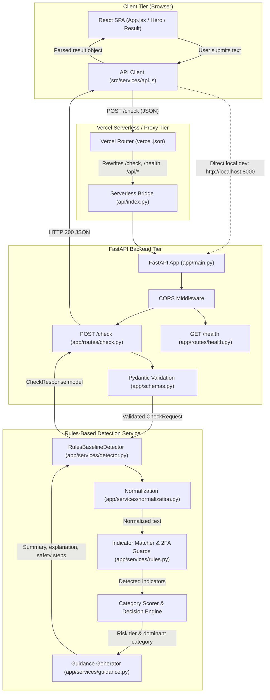

# ScamCheck: Technical Documentation

> **Architecture, Detection Engine, API Contracts, and Deployment Guide**
> *ScamCheck: Explainable Decision Support for Suspicious Text Message Screening*
> **Author / Maintainer:** Quantumdata66

---

## 1. Purpose & System Overview

**ScamCheck** is a lightweight, text-only decision-support web application designed to help users evaluate suspicious messages (such as SMS smishing, fake job recruitment lures, and high-yield investment scams) before taking risky actions.

### Core Intended Use
Users paste suspicious message snippets into the web client. The application analyzes the text against a structured taxonomy of known fraud indicators, classifies the message into an explainable risk tier (`low`, `needs_verification`, or `high`), determines the dominant scam category, highlights matched warning signals, and provides concrete, category-tailored safety guidance.

### Production Engine vs. Experimental Machine Learning Models
- **Production Engine (`RulesBaselineDetector`):** Powers the live application and API. It provides 100% deterministic, explainable rule matching with zero inference latency, explicit indicator tracing, and negative 2FA guard suppression.
- **Machine Learning Experiments (Exp 01, Exp 02, Exp 03):** Located in [`../backend/ml/`](../backend/ml/README.md), these offline statistical models (TF-IDF + Logistic Regression) evaluate n-gram representations, character-level obfuscation robustness, and cross-domain recruitment ad transfer. **The experimental ML models do not power the live production application.**

---

## 2. System Architecture

The ScamCheck application uses a decoupled client-server architecture deployed either locally or as a unified full-stack application on Vercel.

### Request Flow Diagram



### Backend Module Responsibilities

| File Path | Primary Responsibility |
| :--- | :--- |
| [`../backend/app/main.py`](../backend/app/main.py) | Application factory (`create_app()`), CORS configuration, and router registration. |
| [`../backend/app/schemas.py`](../backend/app/schemas.py) | Pydantic request (`CheckRequest`) and response models (`CheckResponse`, `HealthResponse`), enforcing field length and non-empty constraints. |
| [`../backend/app/routes/check.py`](../backend/app/routes/check.py) | Route handler for `POST /check`, delegating message analysis to the detector service. |
| [`../backend/app/routes/health.py`](../backend/app/routes/health.py) | Route handler for `GET /health`, reporting operational health and API version (`0.1.0`). |
| [`../backend/app/services/detector.py`](../backend/app/services/detector.py) | Core orchestration service (`RulesBaselineDetector`) implementing category evidence scoring and multi-factor risk level decision logic. |
| [`../backend/app/services/rules.py`](../backend/app/services/rules.py) | Indicator definitions, regex contextual matchers, and negative 2FA guard suppression. |
| [`../backend/app/services/normalization.py`](../backend/app/services/normalization.py) | Text normalization (whitespace collapsing, case handling, URL pattern extraction). |
| [`../backend/app/services/guidance.py`](../backend/app/services/guidance.py) | Generation of contextual summary headlines, indicator-specific narrative explanations, and 3-point actionable safety advice. |

---

## 3. Detection Pipeline & Decision Logic

The detection engine follows a 5-step explainable pipeline:

```text
Input Message
     │
     â–¼
[ Step 1: Normalization ] ──────> Collapses whitespace, strips control characters, extracts URLs
     │
     â–¼
[ Step 2: Indicator Detection ] ──> Evaluates 16 regex matchers; applies negative 2FA guards
     │
     â–¼
[ Step 3: Evidence Weighting ] ───> Assigns weights (Strong: 3.0, Medium: 1.5, Weak: 0.5) per category
     │
     â–¼
[ Step 4: Risk Determination ] ───> Multi-factor convergence heuristics & category thresholding
     │
     â–¼
[ Step 5: Guidance Generation ] ──> Synthesizes contextual explanation & actionable next steps
     │
     â–¼
CheckResponse Payload
```

### 1. Normalization (`normalization.py`)
- Collapses consecutive whitespace (spaces, tabs, newlines) into a single space using `re.sub(r"\s+", " ", text)`.
- Strips leading and trailing whitespace.
- Preserves raw casing for display while providing lowercase equivalents for case-insensitive matching.
- Extracts static web URLs, domain patterns, and messaging links via `extract_urls()`.

### 2. Indicator Taxonomy & 2FA Guards (`rules.py`)
ScamCheck evaluates 16 discrete indicator definitions across 3 core threat categories and cross-cutting signals:

| Category | Indicator Code | Strength | Weight | Description / Trigger Pattern |
| :--- | :--- | :---: | :---: | :--- |
| **`bank_payment`** | `BANK_CREDENTIAL_HARVEST` | Strong | 3.0 | Demands sensitive credentials (PINs, passwords, OTPs, CVVs, SSNs). |
| **`bank_payment`** | `BANK_PAYMENT_REDIRECT` | Strong | 3.0 | Directs transfers to "safe accounts", cryptocurrency wallets, or gift cards. |
| **`bank_payment`** | `BANK_URGENT_ACTION` | Medium | 1.5 | Threatens immediate account lock, block, or penalty within 24h. |
| **`bank_payment`** | `BANK_UNAUTHORIZED_ALERT` | Medium | 1.5 | Fabricates unauthorized debits to provoke panic disputes. |
| **`fake_job`** | `JOB_UPFRONT_PAYMENT` | Strong | 3.0 | Requires upfront fees for training kits, background checks, or equipment. |
| **`fake_job`** | `JOB_UNREALISTIC_PAY` | Medium | 1.5 | Advertises high daily/hourly wages ($300+/day) for simple tasks. |
| **`fake_job`** | `JOB_NO_INTERVIEW_HIRE` | Medium | 1.5 | Claims immediate selection or hiring without an interview. |
| **`fake_job`** | `JOB_TASK_REBATE` | Medium | 1.5 | Promotes commission tasks (liking videos, app reviews) requiring deposits. |
| **`fake_job`** | `JOB_OFF_PLATFORM` | Weak | 0.5 | Directs job applicants to personal Telegram or WhatsApp accounts. |
| **`investment`** | `INV_GUARANTEED_RETURNS` | Strong | 3.0 | Promises 100% guaranteed, zero-risk, or doubled returns. |
| **`investment`** | `INV_URGENCY_FOMO` | Medium | 1.5 | Pressures investment via limited spots or VIP countdown timers. |
| **`investment`** | `INV_CRYPTO_PLATFORM` | Medium | 1.5 | Solicits deposits into unverified crypto bots, mining pools, or smart contracts. |
| **`investment`** | `INV_INSIDER_MENTOR` | Medium | 1.5 | Advertises unsolicited insider trading signals or portfolio gurus. |
| **Cross-Cutting** | `GEN_SUSPICIOUS_LINK` | Medium | 1.5 | Urges clicking an unverified link to resolve an issue or verify identity. |
| **Cross-Cutting** | `GEN_ANONYMOUS_SENDER` | Weak | 0.5 | Generic impersonal greeting (`Dear Customer`, `Attention User`). |
| **Cross-Cutting** | `GEN_CHANNEL_HOPPING` | Weak | 0.5 | Prompts switching conversation to Telegram, WhatsApp, or Signal. |

#### Negative 2FA Guards
To prevent false alarms on legitimate banking authentication messages, `BANK_CREDENTIAL_HARVEST` inspects text for explicit security disclaimers (`do not share`, `never share`, `will not ask`, `keep confidential`, `no one from`). If a disclaimer is present, the credential-harvesting indicator is suppressed. Similarly, legitimate salary ranges (e.g. corporate `$100k-$150k/year`) and legitimate investment disclaimers (`past performance is no guarantee`) are exempted from false triggers.

### 3. Category Evidence Scoring (`detector.py`)
Each indicator contributes its strength weight to its designated category (`bank_payment`, `fake_job`, or `investment`). The dominant category is assigned to the category with the highest cumulative score. If no category-specific indicators are detected, the category evaluates to `null`.

### 4. Multi-Factor Risk Assessment Logic (`detector.py`)
ScamCheck evaluates indicator counts, strength convergence, and category scores rather than relying on a simplistic indicator count:

```python
# HIGH Risk: Convergence of strong/multiple medium signals
if (
    num_strong >= 2
    or (num_strong >= 1 and num_medium >= 1)
    or (num_strong >= 1 and dominant_category_score >= 3.0)
    or (num_medium >= 2 and dominant_category_score >= 3.0)
    or (num_medium >= 3)
    or (total_score >= 3.5)
):
    return "high", "Multiple warning signs detected"

# LOW Risk: Clean text or at most 1 weak signal
if num_strong == 0 and num_medium == 0 and total_score <= 0.5:
    return "low", "No obvious warning signs detected"

# NEEDS_VERIFICATION: Safe fallback for single or moderate indicators
return "needs_verification", "Needs further verification"
```

### 5. URL Handling
In the current implementation, URLs are handled **statically via regex pattern matching**:
- Identified patterns include standard HTTP/HTTPS URLs, `www.` prefixes, and short chat deep-links (`t.me/*`, `wa.me/*`).
- **No live network calls, DNS resolutions, domain scraping, or sandbox fetching are performed.**

---

## 4. API Contract & Reference

The backend exposes two primary endpoints:

### 1. Health Check (`GET /health`)

Returns the operational status and version of the API.

- **Path:** `/health` (also reachable via `/api/v1/health` if routed)
- **Method:** `GET`
- **Response Headers:** `Content-Type: application/json`
- **Status Code:** `200 OK`

#### Response Example
```json
{
  "status": "healthy",
  "version": "0.1.0"
}
```

---

### 2. Analyze Message (`POST /check`)

Analyzes a submitted text string and returns an explainable risk assessment.

- **Path:** `/check` (also reachable via `/api/v1/check` if routed)
- **Method:** `POST`
- **Request Headers:** `Content-Type: application/json`

#### Request Schema (`CheckRequest`)

| Field | Type | Required | Constraints | Description |
| :--- | :--- | :---: | :--- | :--- |
| `text` | string | Yes* | 1–2000 chars, non-whitespace | Primary field for message content. |
| `message` | string | Yes* | 1–2000 chars, non-whitespace | Accepted as an alias to `text`. |

*\*Either `text` or `message` must be provided.*

```json
{
  "text": "URGENT: Your debit card has been locked due to suspicious activity. Reply with your OTP passcode immediately to restore access."
}
```

#### Response Schema (`CheckResponse`)

| Field | Type | Nullable | Valid Values | Description |
| :--- | :--- | :---: | :--- | :--- |
| `risk_level` | string | No | `"low"`, `"needs_verification"`, `"high"` | Machine-readable risk classification. |
| `risk_label` | string | No | String | UI display label for badges. |
| `summary` | string | No | String | Concise assessment headline. |
| `category` | string | Yes | `"bank_payment"`, `"fake_job"`, `"investment"`, `null` | Identified threat category. |
| `explanation` | string | No | String | Narrative justification detailing matched warning signs. |
| `indicators` | array[string] | No | Array of indicator labels | List of human-readable indicator labels detected. |
| `safety_guidance` | array[string] | No | Array of strings | 3 actionable, protective safety steps. |

#### Response Example (`200 OK`, High Risk)
```json
{
  "risk_level": "high",
  "risk_label": "Multiple warning signs detected",
  "summary": "This message exhibits strong warning signs commonly associated with bank or payment impersonation.",
  "category": "bank_payment",
  "explanation": "This message was flagged because it solicits sensitive credentials (such as PINs, passwords, or one-time security codes) and it applies artificial pressure threatening account suspension or immediate penalties. These characteristics are frequently observed in fraudulent communications. This assessment is decision support and not legal or forensic proof of fraud, but extreme care should be exercised before responding or transferring funds.",
  "indicators": [
    "Request for sensitive credentials or security codes",
    "Urgent request for account action"
  ],
  "safety_guidance": [
    "Contact your bank directly using the official number on the back of your card or via their verified app.",
    "Never share one-time passcodes (OTPs), PINs, or online banking passwords with anyone.",
    "Do not transfer money to 'safe' or 'holding' accounts under any circumstances."
  ]
}
```

#### Response Example (`200 OK`, Low Risk)
```json
{
  "risk_level": "low",
  "risk_label": "No obvious warning signs detected",
  "summary": "No obvious scam warning signs were detected in this message.",
  "category": null,
  "explanation": "Our baseline analysis did not detect known red flags such as artificial urgency, credential requests, or unrealistic financial promises. However, absence of common indicators does not guarantee legitimacy. Targeted or newly crafted messages may not match standard patterns. Always verify unfamiliar requests through official channels.",
  "indicators": [],
  "safety_guidance": [
    "Verify any unexpected requests through an official, trusted contact method.",
    "Never share passwords, PINs, or one-time verification codes with anyone.",
    "Do not forward or click links in unsolicited communications."
  ]
}
```

#### HTTP Status Codes & Error Responses

| Status Code | Reason | Cause | Response Body Example |
| :---: | :--- | :--- | :--- |
| **`200 OK`** | Success | Valid input processed successfully. | Structured `CheckResponse` JSON. |
| **`422 Unprocessable Entity`** | Validation Error | - Input empty or whitespace-only.<br>- Input exceeds 2,000 characters.<br>- Missing `text` or `message` key.<br>- Body is not a valid JSON object. | `{"detail": "Message cannot be empty or contain only whitespace."}` |
| **`500 Internal Server Error`** | Server Error | Unhandled server exception. | `{"detail": "Internal server error"}` |

#### Copyable cURL Examples

```bash
# 1. Health check
curl -X GET "http://localhost:8000/health"

# 2. Analyze suspicious message (High Risk Bank Example)
curl -X POST "http://localhost:8000/check" \
     -H "Content-Type: application/json" \
     -d '{"text": "URGENT: Your account has been suspended. Reply with your OTP code now."}'

# 3. Analyze fake job offer
curl -X POST "http://localhost:8000/check" \
     -H "Content-Type: application/json" \
     -d '{"text": "Congratulations! You are hired for the Remote Assistant role ($500/day). Message recruiter on Telegram @hr_dept."}'
```

---

## 5. Local Development Guide

### Prerequisites
- **Node.js** 18+ (Node 20 or 22 recommended)
- **Python** 3.10+ (Python 3.12 recommended)
- **Git**

---

### Step-by-Step Local Setup

Run the backend and frontend in separate terminal windows:

#### Terminal 1: Backend (FastAPI)
```bash
# 1. Navigate to backend directory
cd backend

# 2. Create virtual environment
python -m venv .venv

# 3. Activate virtual environment
# On Windows (PowerShell):
.\.venv\Scripts\Activate.ps1
# On Linux / macOS:
source .venv/bin/activate

# 4. Install backend dependencies
pip install -r requirements.txt

# 5. Launch FastAPI development server
uvicorn app.main:app --reload --port 8000
```
- API Base URL: `http://localhost:8000`
- Interactive OpenAPI Docs: `http://localhost:8000/docs`

#### Terminal 2: Frontend (React + Vite)
```bash
# 1. From repository root
npm install

# 2. Launch Vite dev server
npm run dev
```
- Frontend Web App: `http://localhost:5173`

---

### Environment Variable Resolution (`VITE_API_BASE_URL`)

The API client in [`../src/services/api.js`](../src/services/api.js) resolves the backend base URL using the following priority:

```javascript
const rawBaseUrl =
  import.meta.env.VITE_API_BASE_URL !== undefined
    ? import.meta.env.VITE_API_BASE_URL
    : import.meta.env.DEV
      ? 'http://localhost:8000'
      : '';
```

1. **`VITE_API_BASE_URL` (Custom Override):** If defined in the build environment, uses the provided base URL.
2. **`import.meta.env.DEV` (Development Mode):** Defaults to `http://localhost:8000` for local decoupled development.
3. **Production Mode (Default):** Defaults to `""` (empty string) to make same-origin relative requests (e.g. `/check`, `/health`), relying on serverless routing in unified Vercel deployments.

---

## 6. Testing & Build Verification

### 1. Automated Backend Test Suite

The backend test suite covers API routing, Pydantic input validation boundary conditions, rule matching, adversarial evasion patterns, and ML dataset splits:

```bash
# From repository root (with virtual environment activated)
pytest backend/tests -v
```

**Test Suite Coverage (88 / 88 tests passing as of the latest run):**
- `test_adversarial.py` (19 tests): Obfuscation, zero-width characters, spacing evasion, and negative 2FA guard suppression.
- `test_check.py` (9 tests): Payload validation, 2000-character boundary limits, empty string rejection, and error responses.
- `test_detector.py` (21 tests): Category scoring, multi-factor risk level thresholding, and guidance synthesis.
- `test_emscad_evaluation.py` (30 tests): EMSCAD text composition, label mapping (`f`/`t`), and deduplication conflict handling.
- `test_emscad_experiment03.py` (8 tests): EMSCAD 70/15/15 disjoint split integrity, model artifact deserialization, and inference shape.
- `test_health.py` (1 test): Operational health endpoint validation.

### 2. Frontend Production Build Check

```bash
# Compile and validate production bundle
npm run build
```
- Bundles the React 19 application using Vite into the `dist/` directory.

---

## 7. Vercel Serverless Deployment Architecture

ScamCheck is configured for zero-configuration full-stack hosting on Vercel using the Python Serverless Runtime.

### Configuration (`vercel.json`)
[`../vercel.json`](../vercel.json) orchestrates the build and API routing:

```json
{
  "buildCommand": "npm run build",
  "outputDirectory": "dist",
  "rewrites": [
    { "source": "/check", "destination": "/api/index.py" },
    { "source": "/health", "destination": "/api/index.py" },
    { "source": "/docs", "destination": "/api/index.py" },
    { "source": "/openapi.json", "destination": "/api/index.py" },
    { "source": "/api/(.*)", "destination": "/api/index.py" }
  ]
}
```

### Serverless Bridge (`api/index.py`)
[`../api/index.py`](../api/index.py) dynamically appends the `backend/` directory to Python's `sys.path` and exposes the FastAPI `app` instance as an ASGI serverless handler.

### Troubleshooting Common Deployment Issues

| Issue | Symptom | Root Cause | Solution |
| :--- | :--- | :--- | :--- |
| **Backend Unreachable** | `TypeError: Failed to fetch` in browser | Dev server is stopped or `VITE_API_BASE_URL` points to an incorrect domain. | Ensure FastAPI is running on port 8000 or verify `VITE_API_BASE_URL` in production env. |
| **CORS Blocked** | `Access-Control-Allow-Origin` error | Request origin is not in `allowed_origins` in [`main.py`](../backend/app/main.py). | Add the client origin to `allowed_origins` in `create_app()`. |
| **HTTP 422 on Long Input** | `Message exceeds maximum length of 2000 characters.` | Input text exceeds boundary limit. | Enforce client-side character counter limit before submission. |
| **Import Errors on Vercel** | Serverless function returns `500` or fails to build | Missing dependencies in [`api/requirements.txt`](../api/requirements.txt). | Ensure `fastapi`, `pydantic`, and `uvicorn` are listed in `api/requirements.txt`. |

---

## 8. Security, Privacy & Operational Boundaries

1. **Decision Support Only:** ScamCheck is an assistive pattern-matching tool, not an investigative authority. It does not provide legal or forensic proof of fraud.
2. **Low Risk $\neq$ Guaranteed Safe:** Threat actors constantly evolve evasion tactics. A `low` risk rating indicates that known red flags were not matched, but does not guarantee that a message or sender is legitimate.
3. **Application-Level Data Handling & Infrastructure Logging:**
   - **No Application Database:** The ScamCheck application codebase contains no database integration, disk persistence, or message storage layer; message evaluation is processed in-memory during the request lifecycle.
   - **Infrastructure & Platform Logs:** While the application code does not persist submitted messages, standard hosting infrastructure (such as Vercel serverless functions, reverse proxies, or ASGI/Uvicorn server runtimes) may record operational metadata (such as HTTP request methods, paths, status codes, timestamps, and client IP addresses) or error traces in server logs according to the hosting environment's default configuration.
4. **No Active Network Probing:** The engine does not crawl links, resolve IP/DNS records, or communicate with external third-party APIs during message evaluation.
5. **Credential Protection Notice:** Users should never share OTPs, PINs, passwords, or financial credentials in response to unverified electronic communications.

---

## 9. Related Documentation & Research Artifacts

- **Repository Root Documentation:** [`../README.md`](../README.md)
- **Technical Indicator Specification:** [`../backend/DETECTION_SPEC.md`](../backend/DETECTION_SPEC.md)
- **Baseline Detector Implementation Spec:** [`../backend/BASELINE_DETECTOR.md`](../backend/BASELINE_DETECTOR.md)
- **Baseline Detector Evaluation Report:** [`../backend/EVALUATION_BASELINE.md`](../backend/EVALUATION_BASELINE.md)
- **Synthetic Dataset Card ($N=210$):** [`../backend/data/ml/DATASET_CARD.md`](../backend/data/ml/DATASET_CARD.md)
- **ML Experiment 01 (Word TF-IDF):** [`../backend/ml/ML_EXPERIMENT_01.md`](../backend/ml/ML_EXPERIMENT_01.md)
- **ML Experiment 02 (Char-WB TF-IDF):** [`../backend/ml/ML_EXPERIMENT_02.md`](../backend/ml/ML_EXPERIMENT_02.md)
- **ML Experiment 03 (EMSCAD Classifier & Transfer):** [`../backend/ml/ML_EXPERIMENT_03.md`](../backend/ml/ML_EXPERIMENT_03.md)
- **EMSCAD External Zero-Shot Evaluation:** [`../backend/ml/EMSCAD_EXTERNAL_EVALUATION.md`](../backend/ml/EMSCAD_EXTERNAL_EVALUATION.md)
- **Machine Learning Architecture Guide:** [`../backend/ml/README.md`](../backend/ml/README.md)
